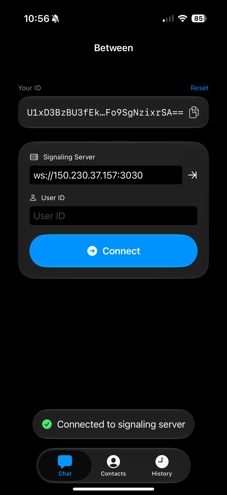
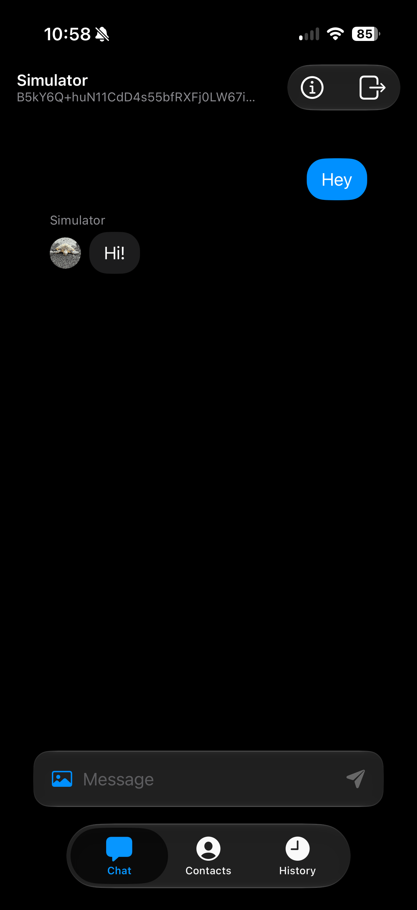
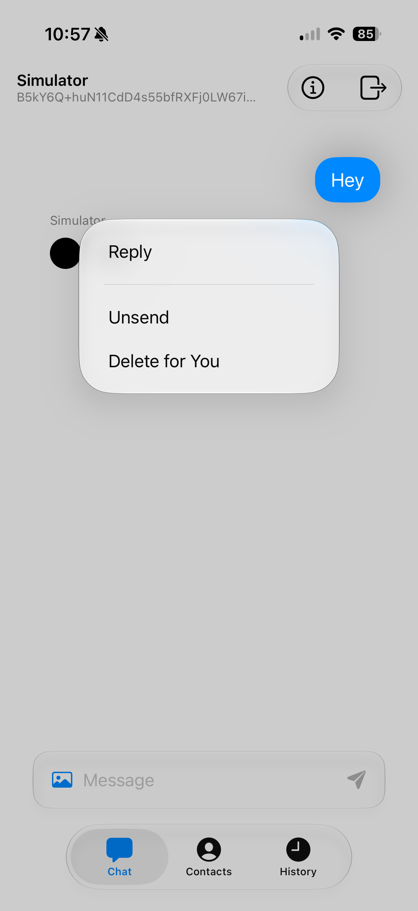
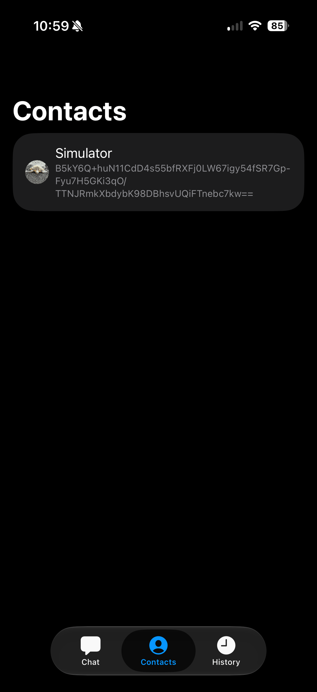
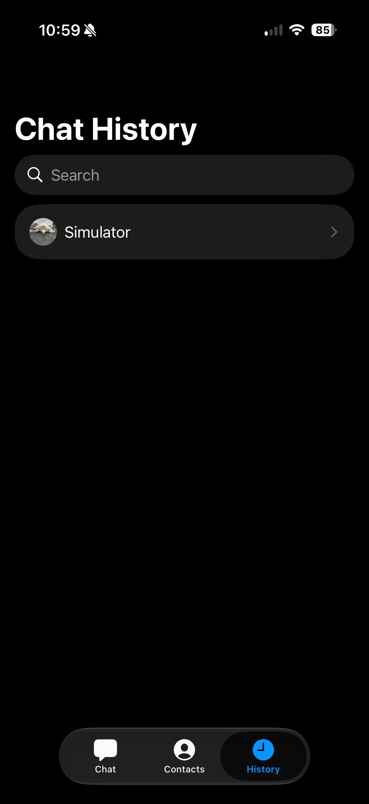

# Between

An end-to-end encrypted, peer-to-peer chat application built with **SwiftUI** and **WebRTC**. 

This repository contains both the iOS client application and a lightweight Node.js signaling server used for the initial peer discovery. Once peers are connected, the signaling server is dropped and all communication happens directly over a secure WebRTC data channel.

## Screenshots

<p align="center">
  
  
  
</p>

## Features

- **Peer-to-Peer Communication:** Direct connection between clients via WebRTC data channels.
- **End-to-End Encryption:** Messages are encrypted before being sent over the peer-to-peer network.
- **Decentralized Signaling:** A minimal Node.js WebSocket server is used strictly for the initial WebRTC handshake (SDP offers/answers and ICE candidates). 
- **Local Persistence:** Chat history and contacts are saved locally on your device using **SwiftData**.
- **Modern UI:** Built entirely with SwiftUI.

## Architecture

- **Client (`chat/`):** A Swift iOS app. Uses `RTCPeerConnection` for establishing the direct link and `RTCDataChannel` for messaging. 
- **Signaling Server (`server/`):** A lightweight WebSocket server (`server.js`) that forwards WebRTC handshake messages (`register`, `offer`, `answer`, `candidate`). It does not handle, see, or store the actual chat messages.

## Prerequisites

- **iOS Client:**
  - Xcode 15 or later
  - iOS 17.0+ device or simulator
  
- **Signaling Server:**
  - Node.js (v14 or later)
  - npm

## Public Signaling Server

By default, the iOS app connects to a small public signaling server hosted on an Oracle Cloud Infrastructure (OCI) instance at `ws://150.230.37.157:3030/`. 
This allows you to test the app immediately without needing to run your own server. Because the signaling server only facilitates the initial peer discovery handshake and does not see or store any of the encrypted chat messages, it is completely secure to use this public instance. However, you can also run your own local signaling server if you prefer, as described below.

## Getting Started

### 1. Run the Signaling Server

Navigate to the server directory, install dependencies, and start the server:

```bash
cd server
npm install
npm start
```

The signaling server will start listening on `ws://0.0.0.0:3030`. 

> **Note:** For physical iOS devices to connect, ensure your iPhone is on the same local network as your Mac, and configure the app to connect to your Mac's local IP address (e.g., `192.168.1.x`) rather than `localhost`.

### 2. Run the iOS App

1. Open `chat.xcodeproj` in Xcode.
2. Select your target device or simulator.
3. Build and run the app.
4. On the connect screen, you can connect to another peer by entering their connection ID (or they can connect to you). Ensure you have configured the signaling server URL appropriately in the app.

## How It Works (WebRTC Flow)

1. **Registration:** When the app launches, it connects to the signaling server and registers its local client ID.
2. **Handshake:** When connecting to a peer, the app generates a WebRTC offer and sends it through the signaling server to the target client. The target replies with an answer, and both exchange ICE candidates to discover the optimal network path.
3. **P2P Connection:** Once the `RTCDataChannel` opens, the app disconnects from the signaling server. 
4. **Messaging:** All subsequent messages (e.g., chat messages, typing indicators) are encrypted and sent directly over the P2P connection, bypassing any central server.

## Contact System

Because WebRTC IDs are long, cryptographic public keys, the app includes a built-in contact system. 
- You can save a peer's ID as a **Contact** with a human-readable name and an optional profile picture.
- Contacts are integrated into the chat history, so you see friendly names and avatars instead of raw IDs.
- Like messages, all contact data is stored securely and locally on your device.



## History
See all chat history, even when not connected to a client.




## Data Management

All data is stored locally using **SwiftData**. 
- To wipe the local database (messages or contacts), you can double-tap the main chat view to bring up the data management alert.

## License

MIT License
